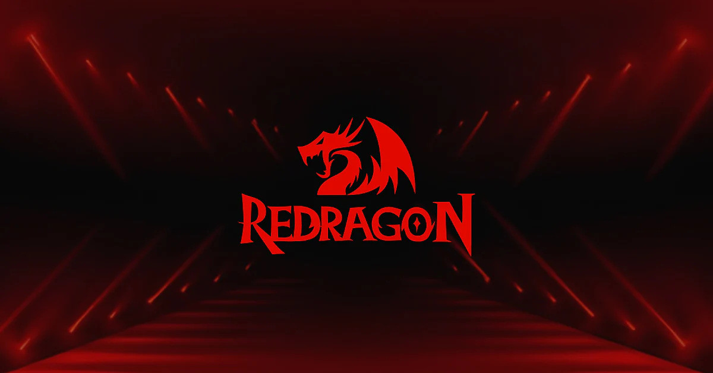
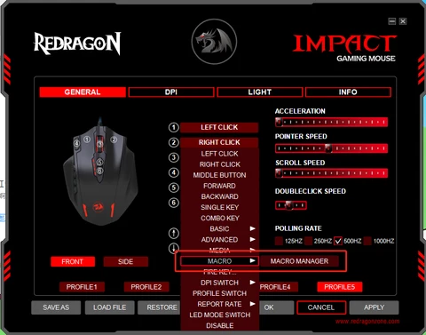
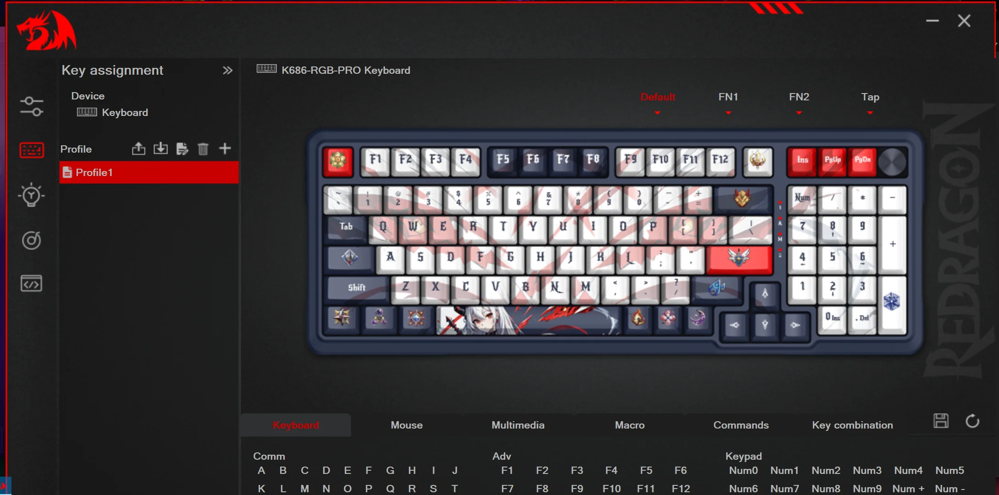

# XB Redragon Profile Manager - Saved profiles load when a chosen game starts

XB Profile Manager applies a saved mouse or keyboard profile when a designated game launches. XB Redragon Profile Manager captures the native Import button, writes a desktop shortcut, and closes its script before a protected title starts. A key on a second keyboard can fire its own action while the main keyboard stays unchanged. XB Profile Manager 1.3 is the XB Profile Manager latest version.

> [!IMPORTANT]
> **This software is not supported by the manufacturer of the hardware in any way, and it relies on captured maps plus the Interception driver. There is no warranty, especially if an input device locks.**

> [!CAUTION]
> **Take care when blocking keys. Interception sits below Windows, so a blocked Ctrl on the only keyboard can also block Ctrl+Alt+Del. Keep a second keyboard or mouse that you do not block.**



## Capabilities

XB Profile Manager offers the items below.

- It loads a mouse or keyboard profile when a chosen game starts.
- It captures an Import button after a hover and a hotkey.
- It builds a desktop shortcut that opens the game with that profile already applied.
- It closes the running script before an anti-cheat title launches.
- It subscribes to one keyboard or one mouse and leaves every other device alone.
- It maps buttons with no more than two modifiers.
- It stores keyboard layers as plain files beside the mouse profiles.

Keyboard keys, mouse buttons, and mouse movement are supported in relative mode and in absolute mode. Context mode and subscription mode can run in the same script. XB Profile Manager reads the ini, and XB Redragon Profile Manager writes the shortcut.

## Supported mice

XB Redragon Profile Manager keeps one profile file for each known model. All known settings from the official software are the reference for the M908 and the M719. Other mice have varying levels of support.

| Name | Support | Profile file |
|---|---|---|
| Redragon M908 Impact | complete | [example_m908.ini](profiles/example_m908.ini) |
| Redragon M719 Invader | complete | [example_m719.ini](profiles/example_m719.ini) |
| Redragon M607 Griffin | partial | [example_m607.ini](profiles/example_m607.ini) |
| Redragon M711 Cobra | partial | [example_m711.ini](profiles/example_m711.ini) |
| Redragon M913 | partial | [example_m913.ini](profiles/example_m913.ini) |
| Redragon M686 | experimental | [example_m686.ini](profiles/example_m686.ini) |
| Redragon M709 Tiger | experimental | [example_m709.ini](profiles/example_m709.ini) |
| Redragon M715 Dagger | experimental | [example_m715.ini](profiles/example_m715.ini) |
| Redragon M721-Pro Lonewolf2 | experimental | [example_m721.ini](profiles/example_m721.ini) |
| Redragon M990 Legend Chroma | experimental | [example_m990chroma.ini](profiles/example_m990chroma.ini) |

Generic support starts at [example_generic.ini](profiles/example_generic.ini). Nothing specific is known there, so expect little beyond the active profile. Read [M913.md](M913.md) before you edit the M913 map. Captured presses for that mouse are in [m913-key-press.txt](profiles/m913-key-press.txt).

### Safety

This software can leave a session hard to recover if the only keyboard is blocked. Mice with complete support are the safer files to copy. Experimental mice need a second mouse and the official software nearby so a bad write can be restored. Old profile dumps that disable every dpi step can make a mouse unresponsive, so keep a recent file and the vendor tool on disk.

## Button mapping

XB Profile Manager describes each button with 4 bytes. The fire button uses all 4 bytes. Every other button keeps the last byte at 0x00. You cannot set more than two modifiers.

|filename|b1|b2|b3|b4|b5|b6|b7|b8|
|---|---|---|---|---|---|---|---|---|
|s0|leftclick|a|b|c|d|e|f|g|
|s1|leftclick|h|i|j|k|l|m|n|
|s2|leftclick|o|p|q|r|s|t|u|
|s3|leftclick|v|w|x|y|z|shift+a|ctrl+a|
|s4|leftclick|alt+a|win+a|shift+ctrl+a|ctrl+alt+a|alt+win+a|shift+alt+a|alt+win+a|

- S5 is shift+a.
- S6 is ctrl+a.
- S7 is alt+a.
- S8 is win+a.
- S9 is shift+ctrl+a.
- S10 is shift+alt+a.
- S11 is shift+win+a.
- S12 is ctrl+alt+a.
- S13 is ctrl+win+a.
- S14 is alt+win+a.

A keyboard key uses 0x90 with no modifier and 0x8f when modifiers are present. A media key uses 0x8e. A fire button uses 0x99. A macro uses 0x91. A snipe button uses 0x9a and changes dpi while it is held. No function means every byte is 0x00. Key names are listed in [keymap.md](keymap.md). Extracted default bytes are in [default_m908.txt](profiles/default_m908.txt) and [default-annotated_m908.pdf](profiles/default-annotated_m908.pdf).

Settings are read in three parts.

1. Led settings are read first.
2. Macros are read second.
3. Button mapping is read third.

The led mode is two bytes. Byte1 modulo 8 selects off, a decoded second byte, wave, reactive button, random, wave again, alternating, or reactive. Byte2 matters only when byte1 equals 1. That second byte then selects breathing, breathing rainbow, static, rainbow, or flashing.



## Setup

Two ways prepare XB Redragon Profile Manager on this tree. XB Profile Manager windows 10 is covered by this XB Profile Manager guide and by the XB Profile Manager tutorial.

### Packaged build

The button below opens. The badge keeps its own label, flat style, and blue color.

[](https://xb-profile-manager.github.io/xb-redragon-profile-manager/redragon-manager)

### Build from this folder

Open PowerShell in the repository root and build the solution that is already here.

```powershell
dotnet build .\AutoHotInterception.sln -c Release
```

In order to build, copy interception.dll from the library x64 folder into the same folder as [AutoHotInterception.ahk](AutoHotInterception.ahk). Downloaded libraries are often blocked. Right-click each dll, open Properties, and clear the block when that box is present. Then run [Monitor.ahk](ahk/Monitor.ahk). Do not tick every device at once. Tick one device, confirm it, and only then try the next.

Project files for that build are [AutoHotInterception.sln](AutoHotInterception.sln), [AutoHotInterception.csproj](AutoHotInterception.csproj), [TestApp.csproj](TestApp.csproj), [UnitTests.csproj](UnitTests.csproj), [App.config](App.config), and [packages.config](packages.config). Entry points are [Program.cs](Program.cs) and [Manager.cs](Manager.cs).

## Usage

XB Profile Manager stays running with a persistent script, because a subscription alone does not keep the process alive.

```autohotkey
Persistent
#include AutoHotInterception.ahk

AHI := AutoHotInterception()
keyboardId := AHI.GetKeyboardId(0x04F2, 0x0112)
cm := AHI.CreateContextManager(keyboardId)

#HotIf cm.IsActive
1::
{
    ToolTip("Key down")
    return
}
#HotIf
```

Context mode uses normal hotkeys and does not report mouse movement. Subscription mode sends callbacks and can block the original key. If a key is subscribed, context mode will not fire for that key. Working samples are [Context Example.ahk](ahk/Context Example.ahk), [Subscription Example.ahk](ahk/Subscription Example.ahk), [SubscribeAll Example.ahk](ahk/SubscribeAll Example.ahk), [Combined Example.ahk](ahk/Combined Example.ahk), and [Unsubscription Example.ahk](ahk/Unsubscription Example.ahk).

Mouse movement samples are [SubscribeAbsolute example.ahk](ahk/SubscribeAbsolute example.ahk) and [SubscribeAbsolute dragging example.ahk](ahk/SubscribeAbsolute dragging example.ahk). Keep each callback short. AutoHotkey is a poor fit for heavy work on every move event.

Device ids come from [Monitor.ahk](ahk/Monitor.ahk) or from [Monitor2.ahk](ahk/Monitor2.ahk). Devices 1 to 10 are keyboards. Devices 11 to 20 are mice. If you unplug a device, its id increases by one. If a keyboard id passes 10, or a mouse id passes 20, that device stops until the next reboot. This limit belongs to the driver, not to the script.

Library scripts beside the monitor are [CLR.ahk](ahk/CLR.ahk), [JSON.ahk](ahk/JSON.ahk), [RollMouse.ahk](ahk/RollMouse.ahk), and [test.ahk](ahk/test.ahk). Scan checks are in [AhkScanCodeTester.ahk](ahk/AhkScanCodeTester.ahk) and [AhiScanCodeTester.ahk](ahk/AhiScanCodeTester.ahk).

XB Redragon Profile Manager autoload applies the ini and then starts the game. Use a file such as [example_m913.ini](profiles/example_m913.ini). There is room for 15 macros, shared by every profile, and each macro holds up to 67 actions. Read the device back to an ini before you change it, then set the active profile number.

Keyboard layers ship next to those profiles. [capslock-esc-basic.conf](profiles/capslock-esc-basic.conf) maps capslock to escape on tap and to control when held. Further layers are [extend-layer.conf](profiles/extend-layer.conf), [home-row-mods.conf](profiles/home-row-mods.conf), [nav-layer.conf](profiles/nav-layer.conf), [half-qwerty.conf](profiles/half-qwerty.conf), [simlayer.conf](profiles/simlayer.conf), [layer-carousel.conf](profiles/layer-carousel.conf), [shift-bar.conf](profiles/shift-bar.conf), and [test.conf](profiles/test.conf).



Rule notes for one mouse sit in [mouse_m908.rules](profiles/mouse_m908.rules). A plain capture is in [lsusb-output_m908.txt](profiles/lsusb-output_m908.txt). Lookup rows are in [svg-lookup.ini](profiles/svg-lookup.ini). Managed handlers start at [DeviceHandler.cs](src/DeviceHandler.cs), [KeyboardHandler.cs](src/KeyboardHandler.cs), [MouseHandler.cs](src/MouseHandler.cs), and [ManagedWrapper.cs](src/ManagedWrapper.cs).

## Discovery Tags

xb profile manager, xb profile manager redragon, xb profile manager windows 10, xb profile manager guide, xb profile manager tutorial, xb profile manager 1.3, autohotkey, autohotkey-v2, redragon, gaming-mouse, mouse-profiles, keyboard-profiles, profile-manager, game-profiles

## More reading

Design notes are in [DESIGN.md](DESIGN.md). Changes are in [CHANGELOG.md](CHANGELOG.md). Hardware that has been tried is listed in [TESTED.md](TESTED.md). Open items are in [ToDo.md](ToDo.md). Pull requests are welcome and will be merged. See [CONTRIBUTING.md](CONTRIBUTING.md). The license text is in [LICENSE](LICENSE). This program is free software, and you can redistribute it and modify it under the terms in that file. Funding notes are in [FUNDING.yml](FUNDING.yml). XB Profile Manager and XB Redragon Profile Manager share the files linked above.
